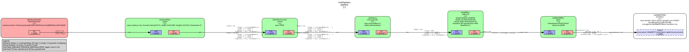

# 🤖 Robot WebRTC Streaming

This repository handles **WebRTC streaming for the robot**, enabling video and audio communication between a robot and a remote app. The system is divided into four main components: **GStreamer**, **Signaling Server**, **TURN Server**, and **Gateway**.

---

## 1. 🎥 GStreamer (stream.py)

GStreamer is used on the robot to handle media streaming using the **webrtc plugin**. It streams **video and audio in both directions**, enabling real-time communication between the robot and a remote client.

### Example Pipeline

Below is an example of a pipeline that captures, encodes and streams out video.



- `webrtcbin` handles the WebRTC signaling and media negotiation.
- Video and audio streams are encoded and sent in real-time to the remote app.

---

## 2. 📡 Signaling Server

The signaling server is **optional**. If the robot's IP is publicly accessible and not behind NAT, the app can connect **directly**. Otherwise, the signaling server helps the app locate the robot and initialize the connection.

- Implemented in `signalingserver.py`
- Currently does **not handle authentication or rate limits**
- Simply relays messages between the robot and app

### How It Works

1. Robot connects to the signaling server and registers itself.
2. App connects to the server and requests a connection to a specific robot.
3. Server relays signaling messages (including stream request, SDP offers/answers, ICE candidates) between the robot and app.
4. Currently, the robot handles all authentication. This should be fixed for production, but since the robot needs to handle authentication for direction connections, this approach is easier.

---

## 3. 🔄 TURN Server

A **TURN server** is used when direct peer-to-peer WebRTC connections fail due to NAT/firewall restrictions. It relays media traffic between the robot and app.

- Turn server hosted on **AWS EC2** US-West
- Uses **coturn** to provide TURN services
- Requires credentials to connect

### Setting Up a TURN Server on EC2

Once you have SSH access to your EC2 instance:

1. **Update system packages**: 
   ```bash
   sudo apt update && sudo apt upgrade -y
   ```

2. **Install coturn**: 
   ```bash
   sudo apt install coturn -y
   ```

3. **Edit the configuration file** (usually `/etc/turnserver.conf`):  
   ```bash
   sudo nano /etc/turnserver.conf
   ```

   ```ini
   listening-port=3478
   min-port=49152  
   max-port=65535  
   user=<username>:<password>  
   external-ip=3.101.80.90  
   realm=kscale  
   fingerprint  
   lt-cred-mech  
   verbose
   ```

   > You can include multiple `user=` lines for different clients.

4. **Start the TURN server**:  
   - **Manual start**: 
     ```bash
     sudo turnserver -c /etc/turnserver.conf
     ```
   - **Enable as a service (starts on boot)**:  
     ```bash
     sudo systemctl enable coturn  
     sudo systemctl start coturn  
     sudo systemctl status coturn
     ```

This ensures that WebRTC streaming works even in restrictive network environments.

---

## 4. 🚪 Gateway

In the future, the app will (ideally) be more connected with the rest of the robot. For example, other incoming data could be battery readings or information about the running policy. Outgoing information could be calibration events and starting/stopping policies. These should be available through direct connections with any device/app with the right credentials.

For this reason, `gateway.py` was created, which handles a single authenticated connection. Traffic from different programs on the robot can open a websocket connection with the gateway on the robot, which relays it to the app. This is not an ideal solution/

### Current Implementation

`gateway.py` opens up a websocket server for direct connections and tries to check in to the signaling server. 

### How It Works

1. **Authentication**: The gateway allows traffic through if the client as provided a correct password.
2. **WebSocket Relay**: Programs running on the robot open WebSocket connections to the local gateway
3. **Message Routing**: The gateway relays messages bidirectionally between robot subsystems and the remote app. Messages from the app contain a service identifier and payload. The gateway uses the service identifier to relay the message to the right WebSocket.
4. **Single Connection**: Currently supports one authenticated app connection at a time

### Future Considerations

1. We still need to figure out what runs on startup, and whether the user should have to SSH into the robot before in order to start services necessary for the app.
2. We might want to have two separate scripts, one that creates a websocket server for direct connection, one that connects to the signaling server.